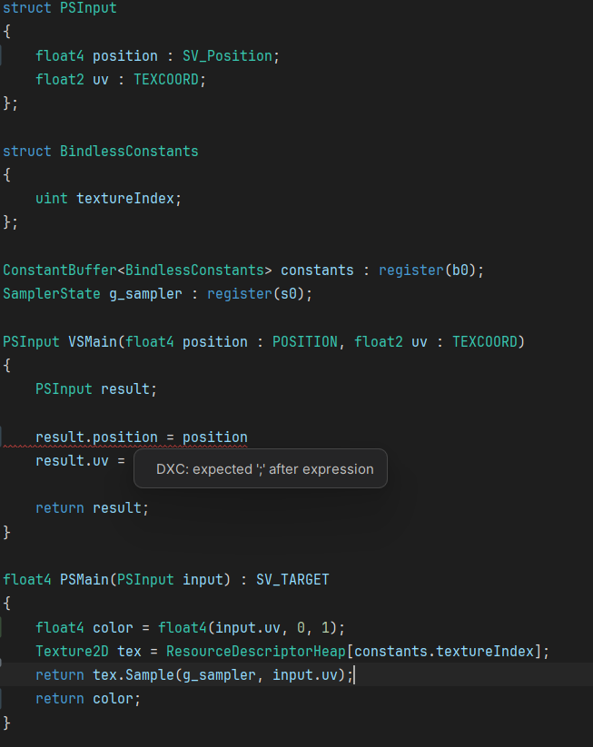

# HLSL Language Support for CLion / IntelliJ

A plugin providing syntax highlighting and DXC validation for HLSL (High Level Shading Language) files.



## Features

- **Syntax highlighting** for keywords, types, built-in functions, semantics, preprocessor directives, numbers, strings, operators, and comments
- **Struct/class name highlighting** — struct, cbuffer, tbuffer names are highlighted at declaration and all usage sites, just like C++
- **DXC compiler validation** — real-time error and warning annotations powered by the DirectX Shader Compiler
- **Line and block commenting** (`Ctrl+/`, `Ctrl+Shift+/`)
- **Brace matching** for `()`, `{}`, `[]`
- **Color settings page** — customize all highlight colors under Settings → Editor → Color Scheme → HLSL

## Supported File Extensions

`hlsl`, `hlsli`, `fx`, `fxh`

Additional extensions can be added via Settings → Editor → File Types → HLSL.

## DXC Validation

The plugin can run the DirectX Shader Compiler (dxc) in the background to show compilation errors and warnings inline.

### Setup

1. Go to **Settings → Tools → HLSL / DXC**
2. The plugin auto-detects `dxc.exe` from your PATH, Windows SDK, or Vulkan SDK
3. Optionally set the path manually, default shader profile (default: `ps_6_6`), entry point (default: `main`), and HLSL version (default: `2021`)

### Per-file Overrides

Use pragma comments at the top of your shader files:

```hlsl
// #pragma hlsl profile vs_6_6
// #pragma hlsl entry VSMain
```

## Building

Requires JDK 21.

```
.\gradlew.bat buildPlugin
```

The plugin zip will be in `build/distributions/`.

## Installation

1. Download the latest `.zip` from the [Releases](../../releases) page, or build it yourself (see above)
2. In CLion/IntelliJ, go to **Settings → Plugins → ⚙ → Install Plugin from Disk...**
3. Select the `.zip` file
4. Restart the IDE

## Compatibility

- IntelliJ Platform 2024.1 – 2026.1
- Works alongside the C/C++ plugin without conflicts

## License

This project is licensed under the [MIT License](LICENSE).
